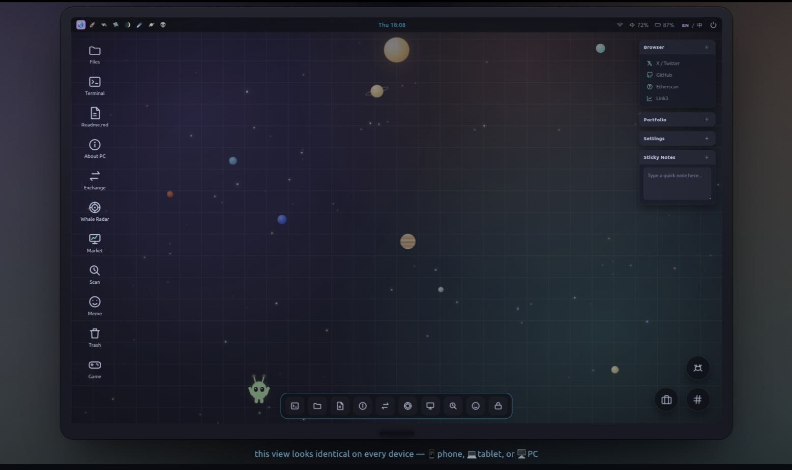

# 0xBabyAlien Web Application

<!-- Badges Header -->

 
 

Welcome to the official repository for **0xBabyAlien**! This is an interactive web platform featuring crypto whale tracking, a community leaderboard, scanner utilities, and interactive mini-games (Asteroids & LinkMe).
  

---

<h2></h2>

- **Whale Radar (`/api/whale-radar.js`)**: Tracks large-volume crypto transactions in real time.
- **Contract & Token Scan (`/api/scan.js`)**: Scanning module to check smart contract or wallet address details.
- **Leaderboard (`/api/leaderboard.js`)**: API endpoint for top user scores and player rankings.
- **Mini-Games & Hub (`/app/`)**:
  - `asteroids.html`: Web-based interactive Asteroids game.
  - `linkme.html`: Community and social link hub.
- **Serverless API Routes (`/api/`)**: Lightweight backend endpoints for data processing and smart contract interactions.

---

<h2></h2>

| Asset | Source |
|---|---|
| `img/0xbabyalien.jpeg`, `img/c0d.jpg`, `img/favicon.ico`,`img/228a.jpg`, `img/android-chrome-192x192.png` | Original/local — created for this project |
| `img/icon/{black,white,color}/*.svg` | [cryptocurrency-icons](https://github.com/atomiclabs/cryptocurrency-icons) (CC0-1.0) |
| `img.shields.io/badge/...`, `cdn.jsdelivr.net/npm/simple-icons` | [Shields.io](https://shields.io) — [Simple Icons](https://simpleicons.org) |
| `js/script.js` | Hotlinked from `assets.coingecko.com` (not stored in repo) |
| `load...` | `load...` |

---

<h2></h2>

<pre>
<!-- START_SECTION:tree -->
.
|-- 404.html
|-- LICENSE
|-- README.md
|-- api
|   |-- [[...config]].js
|   |-- action-contracts.js
|   |-- index.js
|   |-- leaderboard.js
|   |-- scan.js
|   `-- whale-radar.js
|-- app
|   |-- Mass Receive Scanner
|   |   |-- css
|   |   |   `-- style.css
|   |   |-- index.html
|   |   `-- js
|   |       `-- script.js
|   |-- asteroids.htm
|   |-- icon-showcase.html
|   |-- linkme.html
|   `-- templates.html
|-- css
|   |-- background.css
|   |-- error.css
|   |-- load.css
|   `-- style.css
|-- img
|   |-- 0xbabyalien.jpeg
|   |-- 228a.jpg
|   |-- IMG_20260917_180949.jpg
|   |-- android-chrome-192x192.png
|   |-- c0d.jpg
|   |-- favicon.ico
|   `-- icon
|       |-- black
|       |   |-- $pac.svg
|       |   |-- 0xbtc.svg
|       |   |-- 1inch.svg
|       |   |-- 2give.svg
|       |   |-- aave.svg
|       |   |-- abt.svg
|       |   |-- act.svg
|       |   |-- actn.svg
|       |   |-- ada.svg
|       |   |-- add.svg
|       |   |-- adx.svg
|       |   |-- ae.svg
|       |   |-- aeon.svg
|       |   |-- aeur.svg
|       |   |-- agi.svg
|       |   |-- agrs.svg
|       |   |-- aion.svg
|       |   |-- algo.svg
|       |   |-- amb.svg
|       |   |-- amp.svg
|       |   |-- ampl.svg
|       |   |-- ankr.svg
|       |   |-- ant.svg
|       |   |-- ape.svg
|       |   |-- apex.svg
|       |   |-- appc.svg
|       |   |-- ardr.svg
|       |   |-- arg.svg
|       |   |-- ark.svg
|       |   |-- arn.svg
|       |   |-- arnx.svg
|       |   |-- ary.svg
|       |   |-- ast.svg
|       |   |-- atlas.svg
|       |   |-- atm.svg
|       |   |-- atom.svg
|       |   |-- audr.svg
|       |   |-- aury.svg
|       |   |-- auto.svg
|       |   |-- avax.svg
|       |   |-- aywa.svg
|       |   |-- bab.svg
|       |   |-- bal.svg
|       |   |-- band.svg
|       |   |-- bat.svg
|       |   |-- bay.svg
|       |   |-- bcbc.svg
|       |   |-- bcc.svg
|       |   |-- bcd.svg
|       |   |-- bch.svg
|       |   |-- bcio.svg
|       |   |-- bcn.svg
|       |   |-- bco.svg
|       |   |-- bcpt.svg
|       |   |-- bdl.svg
|       |   |-- beam.svg
|       |   |-- bela.svg
|       |   |-- bix.svg
|       |   |-- blcn.svg
|       |   |-- blk.svg
|       |   |-- block.svg
|       |   |-- blz.svg
|       |   |-- bnb.svg
|       |   |-- bnt.svg
|       |   |-- bnty.svg
|       |   |-- booty.svg
|       |   |-- bos.svg
|       |   |-- bpt.svg
|       |   |-- bq.svg
|       |   |-- brd.svg
|       |   |-- bsd.svg
|       |   |-- bsv.svg
|       |   |-- btc.svg
|       |   |-- btcd.svg
|       |   |-- btch.svg
|       |   |-- btcp.svg
|       |   |-- btcz.svg
|       |   |-- btdx.svg
|       |   |-- btg.svg
|       |   |-- btm.svg
|       |   |-- bts.svg
|       |   |-- btt.svg
|       |   |-- btx.svg
|       |   |-- burst.svg
|       |   |-- bze.svg
|       |   |-- call.svg
|       |   |-- cc.svg
|       |   |-- cdn.svg
|       |   |-- cdt.svg
|       |   |-- cenz.svg
|       |   |-- chain.svg
|       |   |-- chat.svg
|       |   |-- chips.svg
|       |   |-- chsb.svg
|       |   |-- chz.svg
|       |   |-- cix.svg
|       |   |-- clam.svg
|       |   |-- cloak.svg
|       |   |-- cmm.svg
|       |   |-- cmt.svg
|       |   |-- cnd.svg
|       |   |-- cnx.svg
|       |   |-- cny.svg
|       |   |-- cob.svg
|       |   |-- colx.svg
|       |   |-- comp.svg
|       |   |-- coqui.svg
|       |   |-- cred.svg
|       |   |-- crpt.svg
|       |   |-- crv.svg
|       |   |-- crw.svg
|       |   |-- cs.svg
|       |   |-- ctr.svg
|       |   |-- ctxc.svg
|       |   |-- cvc.svg
|       |   |-- d.svg
|       |   |-- dai.svg
|       |   |-- dash.svg
|       |   |-- dat.svg
|       |   |-- data.svg
|       |   |-- dbc.svg
|       |   |-- dcn.svg
|       |   |-- dcr.svg
|       |   |-- deez.svg
|       |   |-- dent.svg
|       |   |-- dew.svg
|       |   |-- dgb.svg
|       |   |-- dgd.svg
|       |   |-- dlt.svg
|       |   |-- dnt.svg
|       |   |-- dock.svg
|       |   |-- doge.svg
|       |   |-- dot.svg
|       |   |-- drgn.svg
|       |   |-- drop.svg
|       |   |-- dta.svg
|       |   |-- dth.svg
|       |   |-- dtr.svg
|       |   |-- ebst.svg
|       |   |-- eca.svg
|       |   |-- edg.svg
|       |   |-- edo.svg
|       |   |-- edoge.svg
|       |   |-- ela.svg
|       |   |-- elec.svg
|       |   |-- elf.svg
|       |   |-- elix.svg
|       |   |-- ella.svg
|       |   |-- emb.svg
|       |   |-- emc.svg
|       |   |-- emc2.svg
|       |   |-- eng.svg
|       |   |-- enj.svg
|       |   |-- entrp.svg
|       |   |-- eon.svg
|       |   |-- eop.svg
|       |   |-- eos.svg
|       |   |-- eqli.svg
|       |   |-- equa.svg
|       |   |-- etc.svg
|       |   |-- eth.svg
|       |   |-- ethos.svg
|       |   |-- etn.svg
|       |   |-- etp.svg
|       |   |-- eur.svg
|       |   |-- evx.svg
|       |   |-- exmo.svg
|       |   |-- exp.svg
|       |   |-- fair.svg
|       |   |-- fct.svg
|       |   |-- fida.svg
|       |   |-- fil.svg
|       |   |-- fjc.svg
|       |   |-- fldc.svg
|       |   |-- flo.svg
|       |   |-- flux.svg
|       |   |-- fsn.svg
|       |   |-- ftc.svg
|       |   |-- fuel.svg
|       |   |-- fun.svg
|       |   |-- game.svg
|       |   |-- gas.svg
|       |   |-- gbp.svg
|       |   |-- gbx.svg
|       |   |-- gbyte.svg
|       |   |-- generic.svg
|       |   |-- gin.svg
|       |   |-- glxt.svg
|       |   |-- gmr.svg
|       |   |-- gmt.svg
|       |   |-- gno.svg
|       |   |-- gnt.svg
|       |   |-- gold.svg
|       |   |-- grc.svg
|       |   |-- grin.svg
|       |   |-- grs.svg
|       |   |-- grt.svg
|       |   |-- gsc.svg
|       |   |-- gto.svg
|       |   |-- gup.svg
|       |   |-- gusd.svg
|       |   |-- gvt.svg
|       |   |-- gxs.svg
|       |   |-- gzr.svg
|       |   |-- hight.svg
|       |   |-- hns.svg
|       |   |-- hodl.svg
|       |   |-- hot.svg
|       |   |-- hpb.svg
|       |   |-- hsr.svg
|       |   |-- ht.svg
|       |   |-- html.svg
|       |   |-- huc.svg
|       |   |-- husd.svg
|       |   |-- hush.svg
|       |   |-- icn.svg
|       |   |-- icp.svg
|       |   |-- icx.svg
|       |   |-- ignis.svg
|       |   |-- ilk.svg
|       |   |-- ink.svg
|       |   |-- ins.svg
|       |   |-- ion.svg
|       |   |-- iop.svg
|       |   |-- iost.svg
|       |   |-- iotx.svg
|       |   |-- iq.svg
|       |   |-- itc.svg
|       |   |-- jnt.svg
|       |   |-- jpy.svg
|       |   |-- kcs.svg
|       |   |-- kin.svg
|       |   |-- klown.svg
|       |   |-- kmd.svg
|       |   |-- knc.svg
|       |   |-- krb.svg
|       |   |-- ksm.svg
|       |   |-- lbc.svg
|       |   |-- lend.svg
|       |   |-- leo.svg
|       |   |-- link.svg
|       |   |-- lkk.svg
|       |   |-- loom.svg
|       |   |-- lpt.svg
|       |   |-- lrc.svg
|       |   |-- lsk.svg
|       |   |-- ltc.svg
|       |   |-- lun.svg
|       |   |-- maid.svg
|       |   |-- mana.svg
|       |   |-- matic.svg
|       |   |-- max.svg
|       |   |-- mcap.svg
|       |   |-- mco.svg
|       |   |-- mda.svg
|       |   |-- mds.svg
|       |   |-- med.svg
|       |   |-- meetone.svg
|       |   |-- mft.svg
|       |   |-- miota.svg
|       |   |-- mith.svg
|       |   |-- mkr.svg
|       |   |-- mln.svg
|       |   |-- mnx.svg
|       |   |-- mnz.svg
|       |   |-- moac.svg
|       |   |-- mod.svg
|       |   |-- mona.svg
|       |   |-- msr.svg
|       |   |-- mth.svg
|       |   |-- mtl.svg
|       |   |-- music.svg
|       |   |-- mzc.svg
|       |   |-- nano.svg
|       |   |-- nas.svg
|       |   |-- nav.svg
|       |   |-- ncash.svg
|       |   |-- ndz.svg
|       |   |-- nebl.svg
|       |   |-- neo.svg
|       |   |-- neos.svg
|       |   |-- neu.svg
|       |   |-- nexo.svg
|       |   |-- ngc.svg
|       |   |-- nio.svg
|       |   |-- nkn.svg
|       |   |-- nlc2.svg
|       |   |-- nlg.svg
|       |   |-- nmc.svg
|       |   |-- nmr.svg
|       |   |-- npxs.svg
|       |   |-- ntbc.svg
|       |   |-- nuls.svg
|       |   |-- nxs.svg
|       |   |-- nxt.svg
|       |   |-- oax.svg
|       |   |-- ok.svg
|       |   |-- omg.svg
|       |   |-- omni.svg
|       |   |-- one.svg
|       |   |-- ong.svg
|       |   |-- ont.svg
|       |   |-- oot.svg
|       |   |-- ost.svg
|       |   |-- ox.svg
|       |   |-- oxt.svg
|       |   |-- oxy.svg
|       |   |-- part.svg
|       |   |-- pasc.svg
|       |   |-- pasl.svg
|       |   |-- pax.svg
|       |   |-- paxg.svg
|       |   |-- pay.svg
|       |   |-- payx.svg
|       |   |-- pink.svg
|       |   |-- pirl.svg
|       |   |-- pivx.svg
|       |   |-- plr.svg
|       |   |-- poa.svg
|       |   |-- poe.svg
|       |   |-- polis.svg
|       |   |-- poly.svg
|       |   |-- pot.svg
|       |   |-- powr.svg
|       |   |-- ppc.svg
|       |   |-- ppp.svg
|       |   |-- ppt.svg
|       |   |-- pre.svg
|       |   |-- prl.svg
|       |   |-- pungo.svg
|       |   |-- pura.svg
|       |   |-- qash.svg
|       |   |-- qiwi.svg
|       |   |-- qlc.svg
|       |   |-- qnt.svg
|       |   |-- qrl.svg
|       |   |-- qsp.svg
|       |   |-- qtum.svg
|       |   |-- r.svg
|       |   |-- rads.svg
|       |   |-- rap.svg
|       |   |-- ray.svg
|       |   |-- rcn.svg
|       |   |-- rdd.svg
|       |   |-- rdn.svg
|       |   |-- ren.svg
|       |   |-- rep.svg
|       |   |-- repv2.svg
|       |   |-- req.svg
|       |   |-- rhoc.svg
|       |   |-- ric.svg
|       |   |-- rise.svg
|       |   |-- rlc.svg
|       |   |-- rpx.svg
|       |   |-- rub.svg
|       |   |-- rvn.svg
|       |   |-- ryo.svg
|       |   |-- safe.svg
|       |   |-- safemoon.svg
|       |   |-- sai.svg
|       |   |-- salt.svg
|       |   |-- san.svg
|       |   |-- sand.svg
|       |   |-- sbd.svg
|       |   |-- sberbank.svg
|       |   |-- sc.svg
|       |   |-- ser.svg
|       |   |-- shift.svg
|       |   |-- sib.svg
|       |   |-- sin.svg
|       |   |-- skl.svg
|       |   |-- sky.svg
|       |   |-- slr.svg
|       |   |-- sls.svg
|       |   |-- smart.svg
|       |   |-- sngls.svg
|       |   |-- snm.svg
|       |   |-- snt.svg
|       |   |-- snx.svg
|       |   |-- soc.svg
|       |   |-- sol.svg
|       |   |-- spacehbit.svg
|       |   |-- spank.svg
|       |   |-- sphtx.svg
|       |   |-- srn.svg
|       |   |-- stak.svg
|       |   |-- start.svg
|       |   |-- steem.svg
|       |   |-- storj.svg
|       |   |-- storm.svg
|       |   |-- stox.svg
|       |   |-- stq.svg
|       |   |-- strat.svg
|       |   |-- stx.svg
|       |   |-- sub.svg
|       |   |-- sumo.svg
|       |   |-- sushi.svg
|       |   |-- sys.svg
|       |   |-- taas.svg
|       |   |-- tau.svg
|       |   |-- tbx.svg
|       |   |-- tel.svg
|       |   |-- ten.svg
|       |   |-- tern.svg
|       |   |-- tgch.svg
|       |   |-- theta.svg
|       |   |-- tix.svg
|       |   |-- tkn.svg
|       |   |-- tks.svg
|       |   |-- tnb.svg
|       |   |-- tnc.svg
|       |   |-- tnt.svg
|       |   |-- tomo.svg
|       |   |-- tpay.svg
|       |   |-- trig.svg
|       |   |-- trtl.svg
|       |   |-- trx.svg
|       |   |-- tusd.svg
|       |   |-- tzc.svg
|       |   |-- ubq.svg
|       |   |-- uma.svg
|       |   |-- uni.svg
|       |   |-- unity.svg
|       |   |-- usd.svg
|       |   |-- usdc.svg
|       |   |-- usdt.svg
|       |   |-- utk.svg
|       |   |-- veri.svg
|       |   |-- vet.svg
|       |   |-- via.svg
|       |   |-- vib.svg
|       |   |-- vibe.svg
|       |   |-- vivo.svg
|       |   |-- vrc.svg
|       |   |-- vrsc.svg
|       |   |-- vtc.svg
|       |   |-- vtho.svg
|       |   |-- wabi.svg
|       |   |-- wan.svg
|       |   |-- waves.svg
|       |   |-- wax.svg
|       |   |-- wbtc.svg
|       |   |-- wgr.svg
|       |   |-- wicc.svg
|       |   |-- wings.svg
|       |   |-- wpr.svg
|       |   |-- wtc.svg
|       |   |-- x.svg
|       |   |-- xas.svg
|       |   |-- xbc.svg
|       |   |-- xbp.svg
|       |   |-- xby.svg
|       |   |-- xcp.svg
|       |   |-- xdn.svg
|       |   |-- xem.svg
|       |   |-- xin.svg
|       |   |-- xlm.svg
|       |   |-- xmcc.svg
|       |   |-- xmg.svg
|       |   |-- xmo.svg
|       |   |-- xmr.svg
|       |   |-- xmy.svg
|       |   |-- xp.svg
|       |   |-- xpa.svg
|       |   |-- xpm.svg
|       |   |-- xpr.svg
|       |   |-- xrp.svg
|       |   |-- xsg.svg
|       |   |-- xtz.svg
|       |   |-- xuc.svg
|       |   |-- xvc.svg
|       |   |-- xvg.svg
|       |   |-- xzc.svg
|       |   |-- yfi.svg
|       |   |-- yoyow.svg
|       |   |-- zcl.svg
|       |   |-- zec.svg
|       |   |-- zel.svg
|       |   |-- zen.svg
|       |   |-- zest.svg
|       |   |-- zil.svg
|       |   |-- zilla.svg
|       |   `-- zrx.svg
|       |-- color
|       |   |-- $pac.svg
|       |   |-- 0xbtc.svg
|       |   |-- 1inch.svg
|       |   |-- 2give.svg
|       |   |-- aave.svg
|       |   |-- abt.svg
|       |   |-- act.svg
|       |   |-- actn.svg
|       |   |-- ada.svg
|       |   |-- add.svg
|       |   |-- adx.svg
|       |   |-- ae.svg
|       |   |-- aeon.svg
|       |   |-- aeur.svg
|       |   |-- agi.svg
|       |   |-- agrs.svg
|       |   |-- aion.svg
|       |   |-- algo.svg
|       |   |-- amb.svg
|       |   |-- amp.svg
|       |   |-- ampl.svg
|       |   |-- ankr.svg
|       |   |-- ant.svg
|       |   |-- ape.svg
|       |   |-- apex.svg
|       |   |-- appc.svg
|       |   |-- ardr.svg
|       |   |-- arg.svg
|       |   |-- ark.svg
|       |   |-- arn.svg
|       |   |-- arnx.svg
|       |   |-- ary.svg
|       |   |-- ast.svg
|       |   |-- atlas.svg
|       |   |-- atm.svg
|       |   |-- atom.svg
|       |   |-- audr.svg
|       |   |-- aury.svg
|       |   |-- auto.svg
|       |   |-- avax.svg
|       |   |-- aywa.svg
|       |   |-- bab.svg
|       |   |-- bal.svg
|       |   |-- band.svg
|       |   |-- bat.svg
|       |   |-- bay.svg
|       |   |-- bcbc.svg
|       |   |-- bcc.svg
|       |   |-- bcd.svg
|       |   |-- bch.svg
|       |   |-- bcio.svg
|       |   |-- bcn.svg
|       |   |-- bco.svg
|       |   |-- bcpt.svg
|       |   |-- bdl.svg
|       |   |-- beam.svg
|       |   |-- bela.svg
|       |   |-- bix.svg
|       |   |-- blcn.svg
|       |   |-- blk.svg
|       |   |-- block.svg
|       |   |-- blz.svg
|       |   |-- bnb.svg
|       |   |-- bnt.svg
|       |   |-- bnty.svg
|       |   |-- booty.svg
|       |   |-- bos.svg
|       |   |-- bpt.svg
|       |   |-- bq.svg
|       |   |-- brd.svg
|       |   |-- bsd.svg
|       |   |-- bsv.svg
|       |   |-- btc.svg
|       |   |-- btcd.svg
|       |   |-- btch.svg
|       |   |-- btcp.svg
|       |   |-- btcz.svg
|       |   |-- btdx.svg
|       |   |-- btg.svg
|       |   |-- btm.svg
|       |   |-- bts.svg
|       |   |-- btt.svg
|       |   |-- btx.svg
|       |   |-- burst.svg
|       |   |-- bze.svg
|       |   |-- call.svg
|       |   |-- cc.svg
|       |   |-- cdn.svg
|       |   |-- cdt.svg
|       |   |-- cenz.svg
|       |   |-- chain.svg
|       |   |-- chat.svg
|       |   |-- chips.svg
|       |   |-- chsb.svg
|       |   |-- chz.svg
|       |   |-- cix.svg
|       |   |-- clam.svg
|       |   |-- cloak.svg
|       |   |-- cmm.svg
|       |   |-- cmt.svg
|       |   |-- cnd.svg
|       |   |-- cnx.svg
|       |   |-- cny.svg
|       |   |-- cob.svg
|       |   |-- colx.svg
|       |   |-- comp.svg
|       |   |-- coqui.svg
|       |   |-- cred.svg
|       |   |-- crpt.svg
|       |   |-- crv.svg
|       |   |-- crw.svg
|       |   |-- cs.svg
|       |   |-- ctr.svg
|       |   |-- ctxc.svg
|       |   |-- cvc.svg
|       |   |-- d.svg
|       |   |-- dai.svg
|       |   |-- dash.svg
|       |   |-- dat.svg
|       |   |-- data.svg
|       |   |-- dbc.svg
|       |   |-- dcn.svg
|       |   |-- dcr.svg
|       |   |-- deez.svg
|       |   |-- dent.svg
|       |   |-- dew.svg
|       |   |-- dgb.svg
|       |   |-- dgd.svg
|       |   |-- dlt.svg
|       |   |-- dnt.svg
|       |   |-- dock.svg
|       |   |-- doge.svg
|       |   |-- dot.svg
|       |   |-- drgn.svg
|       |   |-- drop.svg
|       |   |-- dta.svg
|       |   |-- dth.svg
|       |   |-- dtr.svg
|       |   |-- ebst.svg
|       |   |-- eca.svg
|       |   |-- edg.svg
|       |   |-- edo.svg
|       |   |-- edoge.svg
|       |   |-- ela.svg
|       |   |-- elec.svg
|       |   |-- elf.svg
|       |   |-- elix.svg
|       |   |-- ella.svg
|       |   |-- emb.svg
|       |   |-- emc.svg
|       |   |-- emc2.svg
|       |   |-- eng.svg
|       |   |-- enj.svg
|       |   |-- entrp.svg
|       |   |-- eon.svg
|       |   |-- eop.svg
|       |   |-- eos.svg
|       |   |-- eqli.svg
|       |   |-- equa.svg
|       |   |-- etc.svg
|       |   |-- eth.svg
|       |   |-- ethos.svg
|       |   |-- etn.svg
|       |   |-- etp.svg
|       |   |-- eur.svg
|       |   |-- evx.svg
|       |   |-- exmo.svg
|       |   |-- exp.svg
|       |   |-- fair.svg
|       |   |-- fct.svg
|       |   |-- fida.svg
|       |   |-- fil.svg
|       |   |-- fjc.svg
|       |   |-- fldc.svg
|       |   |-- flo.svg
|       |   |-- flux.svg
|       |   |-- fsn.svg
|       |   |-- ftc.svg
|       |   |-- fuel.svg
|       |   |-- fun.svg
|       |   |-- game.svg
|       |   |-- gas.svg
|       |   |-- gbp.svg
|       |   |-- gbx.svg
|       |   |-- gbyte.svg
|       |   |-- generic.svg
|       |   |-- gin.svg
|       |   |-- glxt.svg
|       |   |-- gmr.svg
|       |   |-- gmt.svg
|       |   |-- gno.svg
|       |   |-- gnt.svg
|       |   |-- gold.svg
|       |   |-- grc.svg
|       |   |-- grin.svg
|       |   |-- grs.svg
|       |   |-- grt.svg
|       |   |-- gsc.svg
|       |   |-- gto.svg
|       |   |-- gup.svg
|       |   |-- gusd.svg
|       |   |-- gvt.svg
|       |   |-- gxs.svg
|       |   |-- gzr.svg
|       |   |-- hight.svg
|       |   |-- hns.svg
|       |   |-- hodl.svg
|       |   |-- hot.svg
|       |   |-- hpb.svg
|       |   |-- hsr.svg
|       |   |-- ht.svg
|       |   |-- html.svg
|       |   |-- huc.svg
|       |   |-- husd.svg
|       |   |-- hush.svg
|       |   |-- icn.svg
|       |   |-- icp.svg
|       |   |-- icx.svg
|       |   |-- ignis.svg
|       |   |-- ilk.svg
|       |   |-- ink.svg
|       |   |-- ins.svg
|       |   |-- ion.svg
|       |   |-- iop.svg
|       |   |-- iost.svg
|       |   |-- iotx.svg
|       |   |-- iq.svg
|       |   |-- itc.svg
|       |   |-- jnt.svg
|       |   |-- jpy.svg
|       |   |-- kcs.svg
|       |   |-- kin.svg
|       |   |-- klown.svg
|       |   |-- kmd.svg
|       |   |-- knc.svg
|       |   |-- krb.svg
|       |   |-- ksm.svg
|       |   |-- lbc.svg
|       |   |-- lend.svg
|       |   |-- leo.svg
|       |   |-- link.svg
|       |   |-- lkk.svg
|       |   |-- loom.svg
|       |   |-- lpt.svg
|       |   |-- lrc.svg
|       |   |-- lsk.svg
|       |   |-- ltc.svg
|       |   |-- lun.svg
|       |   |-- maid.svg
|       |   |-- mana.svg
|       |   |-- matic.svg
|       |   |-- max.svg
|       |   |-- mcap.svg
|       |   |-- mco.svg
|       |   |-- mda.svg
|       |   |-- mds.svg
|       |   |-- med.svg
|       |   |-- meetone.svg
|       |   |-- mft.svg
|       |   |-- miota.svg
|       |   |-- mith.svg
|       |   |-- mkr.svg
|       |   |-- mln.svg
|       |   |-- mnx.svg
|       |   |-- mnz.svg
|       |   |-- moac.svg
|       |   |-- mod.svg
|       |   |-- mona.svg
|       |   |-- msr.svg
|       |   |-- mth.svg
|       |   |-- mtl.svg
|       |   |-- music.svg
|       |   |-- mzc.svg
|       |   |-- nano.svg
|       |   |-- nas.svg
|       |   |-- nav.svg
|       |   |-- ncash.svg
|       |   |-- ndz.svg
|       |   |-- nebl.svg
|       |   |-- neo.svg
|       |   |-- neos.svg
|       |   |-- neu.svg
|       |   |-- nexo.svg
|       |   |-- ngc.svg
|       |   |-- nio.svg
|       |   |-- nkn.svg
|       |   |-- nlc2.svg
|       |   |-- nlg.svg
|       |   |-- nmc.svg
|       |   |-- nmr.svg
|       |   |-- npxs.svg
|       |   |-- ntbc.svg
|       |   |-- nuls.svg
|       |   |-- nxs.svg
|       |   |-- nxt.svg
|       |   |-- oax.svg
|       |   |-- ok.svg
|       |   |-- omg.svg
|       |   |-- omni.svg
|       |   |-- one.svg
|       |   |-- ong.svg
|       |   |-- ont.svg
|       |   |-- oot.svg
|       |   |-- ost.svg
|       |   |-- ox.svg
|       |   |-- oxt.svg
|       |   |-- oxy.svg
|       |   |-- part.svg
|       |   |-- pasc.svg
|       |   |-- pasl.svg
|       |   |-- pax.svg
|       |   |-- paxg.svg
|       |   |-- pay.svg
|       |   |-- payx.svg
|       |   |-- pink.svg
|       |   |-- pirl.svg
|       |   |-- pivx.svg
|       |   |-- plr.svg
|       |   |-- poa.svg
|       |   |-- poe.svg
|       |   |-- polis.svg
|       |   |-- poly.svg
|       |   |-- pot.svg
|       |   |-- powr.svg
|       |   |-- ppc.svg
|       |   |-- ppp.svg
|       |   |-- ppt.svg
|       |   |-- pre.svg
|       |   |-- prl.svg
|       |   |-- pungo.svg
|       |   |-- pura.svg
|       |   |-- qash.svg
|       |   |-- qiwi.svg
|       |   |-- qlc.svg
|       |   |-- qnt.svg
|       |   |-- qrl.svg
|       |   |-- qsp.svg
|       |   |-- qtum.svg
|       |   |-- r.svg
|       |   |-- rads.svg
|       |   |-- rap.svg
|       |   |-- ray.svg
|       |   |-- rcn.svg
|       |   |-- rdd.svg
|       |   |-- rdn.svg
|       |   |-- ren.svg
|       |   |-- rep.svg
|       |   |-- repv2.svg
|       |   |-- req.svg
|       |   |-- rhoc.svg
|       |   |-- ric.svg
|       |   |-- rise.svg
|       |   |-- rlc.svg
|       |   |-- rpx.svg
|       |   |-- rub.svg
|       |   |-- rvn.svg
|       |   |-- ryo.svg
|       |   |-- safe.svg
|       |   |-- safemoon.svg
|       |   |-- sai.svg
|       |   |-- salt.svg
|       |   |-- san.svg
|       |   |-- sand.svg
|       |   |-- sbd.svg
|       |   |-- sberbank.svg
|       |   |-- sc.svg
|       |   |-- ser.svg
|       |   |-- shift.svg
|       |   |-- sib.svg
|       |   |-- sin.svg
|       |   |-- skl.svg
|       |   |-- sky.svg
|       |   |-- slr.svg
|       |   |-- sls.svg
|       |   |-- smart.svg
|       |   |-- sngls.svg
|       |   |-- snm.svg
|       |   |-- snt.svg
|       |   |-- snx.svg
|       |   |-- soc.svg
|       |   |-- sol.svg
|       |   |-- spacehbit.svg
|       |   |-- spank.svg
|       |   |-- sphtx.svg
|       |   |-- srn.svg
|       |   |-- stak.svg
|       |   |-- start.svg
|       |   |-- steem.svg
|       |   |-- storj.svg
|       |   |-- storm.svg
|       |   |-- stox.svg
|       |   |-- stq.svg
|       |   |-- strat.svg
|       |   |-- stx.svg
|       |   |-- sub.svg
|       |   |-- sumo.svg
|       |   |-- sushi.svg
|       |   |-- sys.svg
|       |   |-- taas.svg
|       |   |-- tau.svg
|       |   |-- tbx.svg
|       |   |-- tel.svg
|       |   |-- ten.svg
|       |   |-- tern.svg
|       |   |-- tgch.svg
|       |   |-- theta.svg
|       |   |-- tix.svg
|       |   |-- tkn.svg
|       |   |-- tks.svg
|       |   |-- tnb.svg
|       |   |-- tnc.svg
|       |   |-- tnt.svg
|       |   |-- tomo.svg
|       |   |-- tpay.svg
|       |   |-- trig.svg
|       |   |-- trtl.svg
|       |   |-- trx.svg
|       |   |-- tusd.svg
|       |   |-- tzc.svg
|       |   |-- ubq.svg
|       |   |-- uma.svg
|       |   |-- uni.svg
|       |   |-- unity.svg
|       |   |-- usd.svg
|       |   |-- usdc.svg
|       |   |-- usdt.svg
|       |   |-- utk.svg
|       |   |-- veri.svg
|       |   |-- vet.svg
|       |   |-- via.svg
|       |   |-- vib.svg
|       |   |-- vibe.svg
|       |   |-- vivo.svg
|       |   |-- vrc.svg
|       |   |-- vrsc.svg
|       |   |-- vtc.svg
|       |   |-- vtho.svg
|       |   |-- wabi.svg
|       |   |-- wan.svg
|       |   |-- waves.svg
|       |   |-- wax.svg
|       |   |-- wbtc.svg
|       |   |-- wgr.svg
|       |   |-- wicc.svg
|       |   |-- wings.svg
|       |   |-- wpr.svg
|       |   |-- wtc.svg
|       |   |-- x.svg
|       |   |-- xas.svg
|       |   |-- xbc.svg
|       |   |-- xbp.svg
|       |   |-- xby.svg
|       |   |-- xcp.svg
|       |   |-- xdn.svg
|       |   |-- xem.svg
|       |   |-- xin.svg
|       |   |-- xlm.svg
|       |   |-- xmcc.svg
|       |   |-- xmg.svg
|       |   |-- xmo.svg
|       |   |-- xmr.svg
|       |   |-- xmy.svg
|       |   |-- xp.svg
|       |   |-- xpa.svg
|       |   |-- xpm.svg
|       |   |-- xpr.svg
|       |   |-- xrp.svg
|       |   |-- xsg.svg
|       |   |-- xtz.svg
|       |   |-- xuc.svg
|       |   |-- xvc.svg
|       |   |-- xvg.svg
|       |   |-- xzc.svg
|       |   |-- yfi.svg
|       |   |-- yoyow.svg
|       |   |-- zcl.svg
|       |   |-- zec.svg
|       |   |-- zel.svg
|       |   |-- zen.svg
|       |   |-- zest.svg
|       |   |-- zil.svg
|       |   |-- zilla.svg
|       |   `-- zrx.svg
|       `-- white
|           |-- $pac.svg
|           |-- 0xbtc.svg
|           |-- 1inch.svg
|           |-- 2give.svg
|           |-- aave.svg
|           |-- abt.svg
|           |-- act.svg
|           |-- actn.svg
|           |-- ada.svg
|           |-- add.svg
|           |-- adx.svg
|           |-- ae.svg
|           |-- aeon.svg
|           |-- aeur.svg
|           |-- agi.svg
|           |-- agrs.svg
|           |-- aion.svg
|           |-- algo.svg
|           |-- amb.svg
|           |-- amp.svg
|           |-- ampl.svg
|           |-- ankr.svg
|           |-- ant.svg
|           |-- ape.svg
|           |-- apex.svg
|           |-- appc.svg
|           |-- ardr.svg
|           |-- arg.svg
|           |-- ark.svg
|           |-- arn.svg
|           |-- arnx.svg
|           |-- ary.svg
|           |-- ast.svg
|           |-- atlas.svg
|           |-- atm.svg
|           |-- atom.svg
|           |-- audr.svg
|           |-- aury.svg
|           |-- auto.svg
|           |-- avax.svg
|           |-- aywa.svg
|           |-- bab.svg
|           |-- bal.svg
|           |-- band.svg
|           |-- bat.svg
|           |-- bay.svg
|           |-- bcbc.svg
|           |-- bcc.svg
|           |-- bcd.svg
|           |-- bch.svg
|           |-- bcio.svg
|           |-- bcn.svg
|           |-- bco.svg
|           |-- bcpt.svg
|           |-- bdl.svg
|           |-- beam.svg
|           |-- bela.svg
|           |-- bix.svg
|           |-- blcn.svg
|           |-- blk.svg
|           |-- block.svg
|           |-- blz.svg
|           |-- bnb.svg
|           |-- bnt.svg
|           |-- bnty.svg
|           |-- booty.svg
|           |-- bos.svg
|           |-- bpt.svg
|           |-- bq.svg
|           |-- brd.svg
|           |-- bsd.svg
|           |-- bsv.svg
|           |-- btc.svg
|           |-- btcd.svg
|           |-- btch.svg
|           |-- btcp.svg
|           |-- btcz.svg
|           |-- btdx.svg
|           |-- btg.svg
|           |-- btm.svg
|           |-- bts.svg
|           |-- btt.svg
|           |-- btx.svg
|           |-- burst.svg
|           |-- bze.svg
|           |-- call.svg
|           |-- cc.svg
|           |-- cdn.svg
|           |-- cdt.svg
|           |-- cenz.svg
|           |-- chain.svg
|           |-- chat.svg
|           |-- chips.svg
|           |-- chsb.svg
|           |-- chz.svg
|           |-- cix.svg
|           |-- clam.svg
|           |-- cloak.svg
|           |-- cmm.svg
|           |-- cmt.svg
|           |-- cnd.svg
|           |-- cnx.svg
|           |-- cny.svg
|           |-- cob.svg
|           |-- colx.svg
|           |-- comp.svg
|           |-- coqui.svg
|           |-- cred.svg
|           |-- crpt.svg
|           |-- crv.svg
|           |-- crw.svg
|           |-- cs.svg
|           |-- ctr.svg
|           |-- ctxc.svg
|           |-- cvc.svg
|           |-- d.svg
|           |-- dai.svg
|           |-- dash.svg
|           |-- dat.svg
|           |-- data.svg
|           |-- dbc.svg
|           |-- dcn.svg
|           |-- dcr.svg
|           |-- deez.svg
|           |-- dent.svg
|           |-- dew.svg
|           |-- dgb.svg
|           |-- dgd.svg
|           |-- dlt.svg
|           |-- dnt.svg
|           |-- dock.svg
|           |-- doge.svg
|           |-- dot.svg
|           |-- drgn.svg
|           |-- drop.svg
|           |-- dta.svg
|           |-- dth.svg
|           |-- dtr.svg
|           |-- ebst.svg
|           |-- eca.svg
|           |-- edg.svg
|           |-- edo.svg
|           |-- edoge.svg
|           |-- ela.svg
|           |-- elec.svg
|           |-- elf.svg
|           |-- elix.svg
|           |-- ella.svg
|           |-- emb.svg
|           |-- emc.svg
|           |-- emc2.svg
|           |-- eng.svg
|           |-- enj.svg
|           |-- entrp.svg
|           |-- eon.svg
|           |-- eop.svg
|           |-- eos.svg
|           |-- eqli.svg
|           |-- equa.svg
|           |-- etc.svg
|           |-- eth.svg
|           |-- ethos.svg
|           |-- etn.svg
|           |-- etp.svg
|           |-- eur.svg
|           |-- evx.svg
|           |-- exmo.svg
|           |-- exp.svg
|           |-- fair.svg
|           |-- fct.svg
|           |-- fida.svg
|           |-- fil.svg
|           |-- fjc.svg
|           |-- fldc.svg
|           |-- flo.svg
|           |-- flux.svg
|           |-- fsn.svg
|           |-- ftc.svg
|           |-- fuel.svg
|           |-- fun.svg
|           |-- game.svg
|           |-- gas.svg
|           |-- gbp.svg
|           |-- gbx.svg
|           |-- gbyte.svg
|           |-- generic.svg
|           |-- gin.svg
|           |-- glxt.svg
|           |-- gmr.svg
|           |-- gmt.svg
|           |-- gno.svg
|           |-- gnt.svg
|           |-- gold.svg
|           |-- grc.svg
|           |-- grin.svg
|           |-- grs.svg
|           |-- grt.svg
|           |-- gsc.svg
|           |-- gto.svg
|           |-- gup.svg
|           |-- gusd.svg
|           |-- gvt.svg
|           |-- gxs.svg
|           |-- gzr.svg
|           |-- hight.svg
|           |-- hns.svg
|           |-- hodl.svg
|           |-- hot.svg
|           |-- hpb.svg
|           |-- hsr.svg
|           |-- ht.svg
|           |-- html.svg
|           |-- huc.svg
|           |-- husd.svg
|           |-- hush.svg
|           |-- icn.svg
|           |-- icp.svg
|           |-- icx.svg
|           |-- ignis.svg
|           |-- ilk.svg
|           |-- ink.svg
|           |-- ins.svg
|           |-- ion.svg
|           |-- iop.svg
|           |-- iost.svg
|           |-- iotx.svg
|           |-- iq.svg
|           |-- itc.svg
|           |-- jnt.svg
|           |-- jpy.svg
|           |-- kcs.svg
|           |-- kin.svg
|           |-- klown.svg
|           |-- kmd.svg
|           |-- knc.svg
|           |-- krb.svg
|           |-- ksm.svg
|           |-- lbc.svg
|           |-- lend.svg
|           |-- leo.svg
|           |-- link.svg
|           |-- lkk.svg
|           |-- loom.svg
|           |-- lpt.svg
|           |-- lrc.svg
|           |-- lsk.svg
|           |-- ltc.svg
|           |-- lun.svg
|           |-- maid.svg
|           |-- mana.svg
|           |-- matic.svg
|           |-- max.svg
|           |-- mcap.svg
|           |-- mco.svg
|           |-- mda.svg
|           |-- mds.svg
|           |-- med.svg
|           |-- meetone.svg
|           |-- mft.svg
|           |-- miota.svg
|           |-- mith.svg
|           |-- mkr.svg
|           |-- mln.svg
|           |-- mnx.svg
|           |-- mnz.svg
|           |-- moac.svg
|           |-- mod.svg
|           |-- mona.svg
|           |-- msr.svg
|           |-- mth.svg
|           |-- mtl.svg
|           |-- music.svg
|           |-- mzc.svg
|           |-- nano.svg
|           |-- nas.svg
|           |-- nav.svg
|           |-- ncash.svg
|           |-- ndz.svg
|           |-- nebl.svg
|           |-- neo.svg
|           |-- neos.svg
|           |-- neu.svg
|           |-- nexo.svg
|           |-- ngc.svg
|           |-- nio.svg
|           |-- nkn.svg
|           |-- nlc2.svg
|           |-- nlg.svg
|           |-- nmc.svg
|           |-- nmr.svg
|           |-- npxs.svg
|           |-- ntbc.svg
|           |-- nuls.svg
|           |-- nxs.svg
|           |-- nxt.svg
|           |-- oax.svg
|           |-- ok.svg
|           |-- omg.svg
|           |-- omni.svg
|           |-- one.svg
|           |-- ong.svg
|           |-- ont.svg
|           |-- oot.svg
|           |-- ost.svg
|           |-- ox.svg
|           |-- oxt.svg
|           |-- oxy.svg
|           |-- part.svg
|           |-- pasc.svg
|           |-- pasl.svg
|           |-- pax.svg
|           |-- paxg.svg
|           |-- pay.svg
|           |-- payx.svg
|           |-- pink.svg
|           |-- pirl.svg
|           |-- pivx.svg
|           |-- plr.svg
|           |-- poa.svg
|           |-- poe.svg
|           |-- polis.svg
|           |-- poly.svg
|           |-- pot.svg
|           |-- powr.svg
|           |-- ppc.svg
|           |-- ppp.svg
|           |-- ppt.svg
|           |-- pre.svg
|           |-- prl.svg
|           |-- pungo.svg
|           |-- pura.svg
|           |-- qash.svg
|           |-- qiwi.svg
|           |-- qlc.svg
|           |-- qnt.svg
|           |-- qrl.svg
|           |-- qsp.svg
|           |-- qtum.svg
|           |-- r.svg
|           |-- rads.svg
|           |-- rap.svg
|           |-- ray.svg
|           |-- rcn.svg
|           |-- rdd.svg
|           |-- rdn.svg
|           |-- ren.svg
|           |-- rep.svg
|           |-- repv2.svg
|           |-- req.svg
|           |-- rhoc.svg
|           |-- ric.svg
|           |-- rise.svg
|           |-- rlc.svg
|           |-- rpx.svg
|           |-- rub.svg
|           |-- rvn.svg
|           |-- ryo.svg
|           |-- safe.svg
|           |-- safemoon.svg
|           |-- sai.svg
|           |-- salt.svg
|           |-- san.svg
|           |-- sand.svg
|           |-- sbd.svg
|           |-- sberbank.svg
|           |-- sc.svg
|           |-- ser.svg
|           |-- shift.svg
|           |-- sib.svg
|           |-- sin.svg
|           |-- skl.svg
|           |-- sky.svg
|           |-- slr.svg
|           |-- sls.svg
|           |-- smart.svg
|           |-- sngls.svg
|           |-- snm.svg
|           |-- snt.svg
|           |-- snx.svg
|           |-- soc.svg
|           |-- sol.svg
|           |-- spacehbit.svg
|           |-- spank.svg
|           |-- sphtx.svg
|           |-- srn.svg
|           |-- stak.svg
|           |-- start.svg
|           |-- steem.svg
|           |-- storj.svg
|           |-- storm.svg
|           |-- stox.svg
|           |-- stq.svg
|           |-- strat.svg
|           |-- stx.svg
|           |-- sub.svg
|           |-- sumo.svg
|           |-- sushi.svg
|           |-- sys.svg
|           |-- taas.svg
|           |-- tau.svg
|           |-- tbx.svg
|           |-- tel.svg
|           |-- ten.svg
|           |-- tern.svg
|           |-- tgch.svg
|           |-- theta.svg
|           |-- tix.svg
|           |-- tkn.svg
|           |-- tks.svg
|           |-- tnb.svg
|           |-- tnc.svg
|           |-- tnt.svg
|           |-- tomo.svg
|           |-- tpay.svg
|           |-- trig.svg
|           |-- trtl.svg
|           |-- trx.svg
|           |-- tusd.svg
|           |-- tzc.svg
|           |-- ubq.svg
|           |-- uma.svg
|           |-- uni.svg
|           |-- unity.svg
|           |-- usd.svg
|           |-- usdc.svg
|           |-- usdt.svg
|           |-- utk.svg
|           |-- veri.svg
|           |-- vet.svg
|           |-- via.svg
|           |-- vib.svg
|           |-- vibe.svg
|           |-- vivo.svg
|           |-- vrc.svg
|           |-- vrsc.svg
|           |-- vtc.svg
|           |-- vtho.svg
|           |-- wabi.svg
|           |-- wan.svg
|           |-- waves.svg
|           |-- wax.svg
|           |-- wbtc.svg
|           |-- wgr.svg
|           |-- wicc.svg
|           |-- wings.svg
|           |-- wpr.svg
|           |-- wtc.svg
|           |-- x.svg
|           |-- xas.svg
|           |-- xbc.svg
|           |-- xbp.svg
|           |-- xby.svg
|           |-- xcp.svg
|           |-- xdn.svg
|           |-- xem.svg
|           |-- xin.svg
|           |-- xlm.svg
|           |-- xmcc.svg
|           |-- xmg.svg
|           |-- xmo.svg
|           |-- xmr.svg
|           |-- xmy.svg
|           |-- xp.svg
|           |-- xpa.svg
|           |-- xpm.svg
|           |-- xpr.svg
|           |-- xrp.svg
|           |-- xsg.svg
|           |-- xtz.svg
|           |-- xuc.svg
|           |-- xvc.svg
|           |-- xvg.svg
|           |-- xzc.svg
|           |-- yfi.svg
|           |-- yoyow.svg
|           |-- zcl.svg
|           |-- zec.svg
|           |-- zel.svg
|           |-- zen.svg
|           |-- zest.svg
|           |-- zil.svg
|           |-- zilla.svg
|           `-- zrx.svg
|-- index.html
|-- js
|   |-- background.js
|   |-- error.js
|   |-- icons-black.js
|   |-- icons-color.js
|   |-- icons-white.js
|   |-- load.js
|   |-- main.js
|   `-- script.js
|-- package.json
|-- template
|   `-- portfolio-001
|       |-- index.html
|       |-- script.js
|       `-- style.css
|-- 👽.html
`-- 🚀.html

15 directories, 1490 files
<!-- END_SECTION:tree -->
</pre>

---

